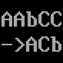
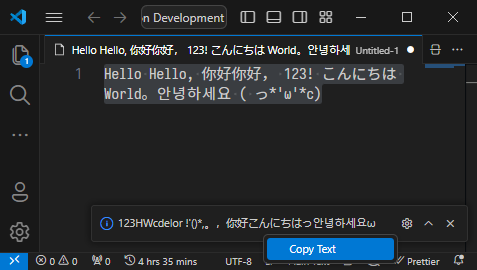

# used-characters



This plugin can help you quickly understand which characters are used in a certain content. It is usually used when doing font simplification and other operations.

本插件可以帮助您快速了解某段内容中都使用了哪些字符。通常在做字体精简等操作时会用到。

## Features



The function and operation are very simple:

1. Select a text.
2. In the command selection area (shortcut: `Ctrl+Shift+P`), enter `usedchar` and press Enter.
3. A tooltip will appear in the lower right corner, telling you which characters are used. You can right-click in the tooltip and select `Copy Text`.

- You can find the full command of this plugin in the selection list below after typing `usedchar`. Press the gear icon to the right of the command to assign a shortcut key to it.
- Characters are automatically sorted in the following order: `0-9`, `A-Z`, `a-z`, English punctuation, Japanese characters, Korean characters, other languages ​​and special symbols.

功能和操作非常简单：

1. 选定一段文本。
2. 在命令选择区 (快捷键:`Ctrl+Shift+P`) 输入 `usedchar` 并回车。
3. 右下角会出现提示框，告诉你都使用了哪些字符。你可以在提示框按鼠标右键，选择 `复制文本` 。

- 你可以在输入 `usedchar` 后，在下面的选择列表中找到本插件的完整命令，按该命令右侧的齿轮图标，可以为其指定快捷键。
- 字符会自动进行排序，顺序为: `0-9`, `A-Z`, `a-z`, 英文标点, 日文字符, 韩文字符, 其他语言和特殊符号 。

### Demo

- `AAA bbb 0123 !!`
  - -> `0123Ab !`
- `Run Extension: Extension Host [0]`
  - -> `0EHReinostux :[]`
- `Hello Hello, 你好你好， 123! こんにちは World。안녕하세요 ( っ*'ω'*c)`
  - -> `123HWcdelor !'()*,。，你好こんにちはっ안녕하세요ω`
- `如果你能记住我的名字，如果你们都能记住我的名字，也许我或者“我们”，终有一天能自由地生存着。`
  - -> `“”。，如果你能记住我的名字们都也许或者终有一天自由地生存着`

## Compile

```sh
npm install -g yo generator-code @vscode/vsce
npm install
npm run compile
vsce package
```

## Release Notes

### 1.0.0

- Initial release.
- Core functions.

## LICENSE

Copyright (c) 2024 KagurazakaYashi
used-characters is licensed under Mulan PSL v2.
You can use this software according to the terms and conditions of the Mulan
PSL v2.
You may obtain a copy of Mulan PSL v2 at:
         http://license.coscl.org.cn/MulanPSL2
THIS SOFTWARE IS PROVIDED ON AN "AS IS" BASIS, WITHOUT WARRANTIES OF ANY
KIND, EITHER EXPRESS OR IMPLIED, INCLUDING BUT NOT LIMITED TO
NON-INFRINGEMENT, MERCHANTABILITY OR FIT FOR A PARTICULAR PURPOSE.
See the Mulan PSL v2 for more details.
